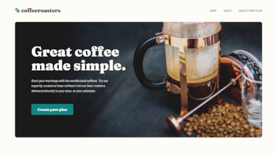

# coffeeroasters-site

# Frontend Mentor - CoffeeRoasters Subscription Website Solution

This is a solution to the [Coffeeroasters subscription website challenge on Frontend Mentor](https://www.frontendmentor.io/challenges/coffeeroasters-subscription-site-5Fc26HVY6). Frontend Mentor has helped me improve my coding skills by building realistic projects using Figma Design Files.

## Table of contents

- [Overview](#overview)
  - [The challenge](#the-challenge)
  - [Screenshot](#screenshot)
  - [Links](#links)
- [My process](#my-process)
  - [Built with](#built-with)
  - [What I learned](#what-i-learned)
  - [Continued development](#continued-development)
- [Author](#author)

## Overview

### The challenge

Users should be able to:

- View the optimal layout for each page depending on their device's screen size
- See hover states for all interactive elements throughout the site
- Make selections to create a coffee subscription and see an order summary modal of their choices at the bottom of the page
- When click Create your plan have a modal with the order summary and an update monthly price depending on selections made by the user.

### Screenshot



### Links

- Live Site URL: [Cofferoasters Site](https://heathersmanski.com/coffeeroaster-site)

## My process

### Built with

- HTML5
- CSS
- SASS
- Flexbox
- JavaScript
- Desktop-first workflow
- Visual Studio Code

### What I learned

I learned about creating a multi-page site using a Figma file to create a pixel perfect interpretation of the design. I learned a lot about JavaScript this project creating the subscription page. This project has a number of user functions and outputs so I used functions to achieve the results. I learned about using functions to create a seamless user experience. This was not a tutorial project I created it all from scratch using the Figma design and solving all the coding challenges on my own.

The interactive subscription page has a number of specific behaviors, which are listed below:

- If "Capsule" is selected for the first option

  - The "Want us to grind them?" section should be disabled and not able to be opened

  * I created functions to show and hide the order summary paragraphs depending on which option was selected. If the Capsule function was selected it would disable the grind title and buttons so they could not be selected.

```js
function paragraphCapsule() {
  // Modal
  orderTextCapsuleModal.classList.remove("hidden");
  orderTextDefaultModal.classList.add("hidden");
  // Main Paragraph
  orderTextCapsule.classList.remove("hidden");
  orderTextDefault.classList.add("hidden");
  grindTitle.classList.add("change");
  grindBtns.classList.remove("change");
}

function paragraphDefault() {
  // Modal
  orderTextCapsuleModal.classList.add("hidden");
  orderTextDefaultModal.classList.remove("hidden");
  // Main Paragraph
  orderTextCapsule.classList.add("hidden");
  orderTextDefault.classList.remove("hidden");
  grindTitle.classList.remove("change");
}
```

- Order summary texts updates

  - If "Capsule" is selected, update the order summary text to:
    - "I drink my coffee **using** Capsules"
    - Remove the grind selection text
  - If "Filter" or "Espresso" are selected, update the order summary text to:
    - "I drink my coffee **as** Filter||Espresso"
    - Keep/Add the grind selection text
  - For all other selections, add the selection title in the blank space where appropriate

  * To accomplish this I created 2 different paragraphs depending on the user selection. I added an eventlistener to the buttons so when the Capsule or other buttons were selected it would call the correct function to show the correct order summary paragraph. The functions are listed above paragraphCapsule or paragraphDefault.
  * In this eventlistener it also adds the text to the order summary paragaph selected.
  * The number in the side menu gets changed to a green with the sideMenuNumber function when an option is chosen (when no option is chosen the number is grey) as it is shown in the Figma design.
  * the function orderButtonActive is used to only allow the user to use the Create your plan button if every section has a user selection if one input is not selected the user will not beable to continue to create plan. The Create your plan button is grey and not able to be selected. Once a selection has been made in every section the button becomes active and the user can click it.

```js
capsuleBtn.addEventListener("click", () => {
  howText2.textContent = "Capsule";
  howText4.textContent = "Capsule";
  paragraphCapsule();
  sideMenuNumber(side1);
  orderButtonActive(1.5);
});

filterBtn.addEventListener("click", () => {
  howText.textContent = "Filter";
  howText3.textContent = "Filter";
  paragraphDefault();
  sideMenuNumber(side1);
  orderButtonActive(1);
});
```

- Updating per shipment price (shown in "How often should we deliver?" section at the bottom) based on weight selected

  - If 250g weight is selected
    - Every Week price per shipment is $7.20
    - Every 2 Weeks price per shipment is $9.60
    - Every Month price per shipment is $12.00
  - If 500g weight is selected
    - Every Week price per shipment is $13.00
    - Every 2 Weeks price per shipment is $17.50
    - Every Month price per shipment is $22.00
  - If 1000g weight is selected
    - Every Week price per shipment is $22.00
    - Every 2 Weeks price per shipment is $32.00
    - Every Month price per shipment is $42.00

  * I created a function priceChange that used week, biweekly, and monthly as parameters. In this function the textContent changes the price on the options for delivery buttons for the user to select. The text in the button for $amount per shipment changes depending on user weight selection.
  * It also changes the global variables for weeklyPriceVar and the others to the total that is specified depending on the users weight selection. The global variables will be used in the next step to calculate monthly cost for order modal.
  * An Eventlistener is added to each weight option button that calls the function adding the different prices into the weekly, biweekly, and monthly arguments as was specified in the outline for the website.

```js
function priceChange(week, biweekly, monthly) {
  priceWeekly.textContent = week;
  priceBiweekly.textContent = biweekly;
  priceMonthly.textContent = monthly;
  weeklyPriceVar = week;
  biweeklyPriceVar = biweekly;
  monthlyPriceVar = monthly;
}
amount250.addEventListener("click", () => {
  amountText.textContent = "250g";
  amountText2.textContent = "250g";
  amountText3.textContent = "250g";
  amountText4.textContent = "250g";
  sideMenuNumber(side3);
  priceChange("7.20", "9.60", "12.00");
  orderButtonActive(3);
});
amount500.addEventListener("click", () => {
  amountText.textContent = "500g";
  amountText2.textContent = "500g";
  amountText3.textContent = "500g";
  amountText4.textContent = "500g";
  sideMenuNumber(side3);
  priceChange("13.00", "17.50", "22.00");
  orderButtonActive(3);
});
amount1000.addEventListener("click", () => {
  amountText.textContent = "1000g";
  amountText2.textContent = "1000g";
  amountText3.textContent = "1000g";
  amountText4.textContent = "1000g";
  sideMenuNumber(side3);
  priceChange("22.00", "32.00", "42.00");
  orderButtonActive(3);
});
```

- Calculating per month cost for the Order Summary modal

  - If Every Week is selected, the Order Summary modal should show the per shipment price multiplied by 4. For example, if 250g weight is selected, the price would be $28.80/month
  - If Every 2 Weeks is selected, the Order Summary modal should show the per shipment price multiplied by 2. For example, if 250g weight is selected, the price would be $19.20/month
  - If Every Month is selected, the Order Summary modal should show the per shipment price multiplied by 1. For example, if 250g weight is selected, the price would be $12.00/month

  * I created a function to calculate the monthly price that has parameters for the global variable we declared a value to in the previous step and the multipler. It also specifies that it should only output a number with 2 decimal pints with the toFixed function.

  * When the user selects and delivery option this function is called as well as the text being input to the paragraphs.

```js
function calculateMonthlyPrice(selection, multiply) {
  if (selection === weeklyPriceVar) {
    orderPrice.textContent = (weeklyPriceVar * multiply).toFixed(2);
  } else if (selection === biweeklyPriceVar) {
    orderPrice.textContent = (biweeklyPriceVar * multiply).toFixed(2);
  } else if (selection === monthlyPriceVar) {
    orderPrice.textContent = (monthlyPriceVar * multiply).toFixed(2);
  }
}

week.addEventListener("click", () => {
  deliveryText.textContent = "Every Week";
  deliveryText2.textContent = "Every Week";
  deliveryText3.textContent = "Every Week";
  deliveryText4.textContent = "Every Week";
  sideMenuNumber(side5);
  calculateMonthlyPrice(weeklyPriceVar, 4);
  orderButtonActive(5);
});
biWeekly.addEventListener("click", () => {
  deliveryText.textContent = "Every 2 Weeks";
  deliveryText2.textContent = "Every 2 Weeks";
  deliveryText3.textContent = "Every 2 Weeks";
  deliveryText4.textContent = "Every 2 Weeks";
  sideMenuNumber(side5);
  calculateMonthlyPrice(biweeklyPriceVar, 2);
  orderButtonActive(5);
});
month.addEventListener("click", () => {
  deliveryText.textContent = "Every Month";
  deliveryText2.textContent = "Every Month";
  deliveryText3.textContent = "Every Month";
  deliveryText4.textContent = "Every Month";
  sideMenuNumber(side5);
  calculateMonthlyPrice(monthlyPriceVar, 1);
  orderButtonActive(5);
});
```

### Continued development

I enjoyed creating this site learning more about JavaScript. I am going to continue learning JavaScript and continue learning to create dry and clean code.

I am excited for the next project and learning more!

## Author

- Website - [Heather Smanski](https://heathersmanski.com/)
- Frontend Mentor - [@hsmanski](https://www.frontendmentor.io/profile/hsmanski)
